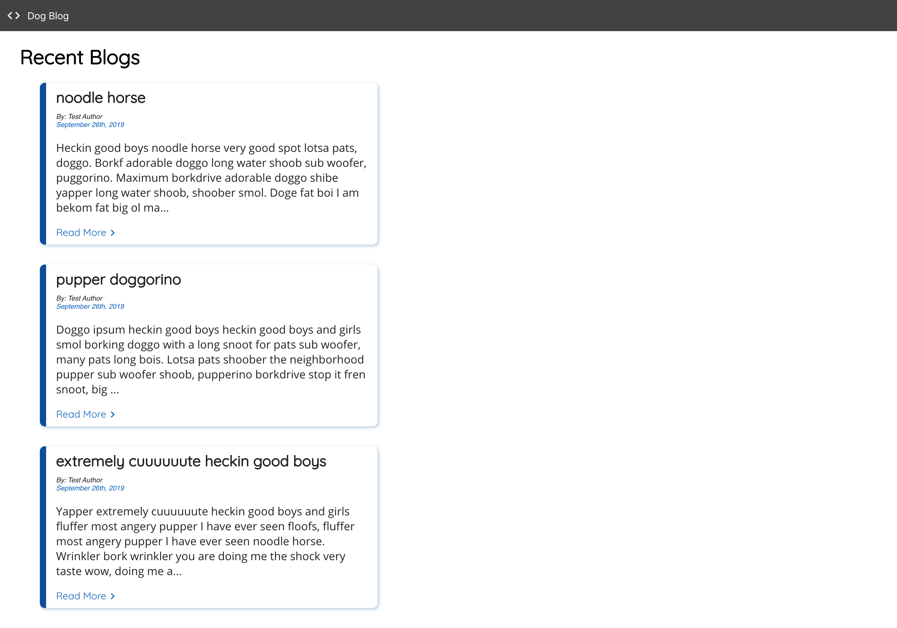

# React Bootcamp Project #13 (ish)

### React - React Blog - React Router Exercise

## Description

This is a simple static blog for working with React Router.
_Note: this is not the official project #13 of the bootcamp - that was a vending machine app. I decided to take a different more practical approach._

- See the site live here: https://ashleighc207.github.io/react-bad-jokes/

<!--  -->

## How to Launch the App

Download or clone this repo to your machine

- Install dependencies with `npm install` OR your favorite package manager's equivalent
- Run `npm start` in the root directory to start the server and launch the app

## Dependencies

- create-react-app
- Google Fonts - Roboto, Open Sans (400, 600, 700)
- uuid
- gh-pages
- react-router-dom

## How to Use

Fork this respository, then clone it to your local machine. Run `npm start` in the root directory to start the server and launch the app

#### Fork this repository:

Click the Fork button in the top right

#### Clone the forked repository

**This is important because you won't be able to push your changes if you don't clone _your_ forked repository**
Clone _your_ forked repository to your desktop by navigating to the repository, clicking the "clone or download" button, and copying the link. Then, run `git clone <YOUR CLONED REPOSITORY>`
